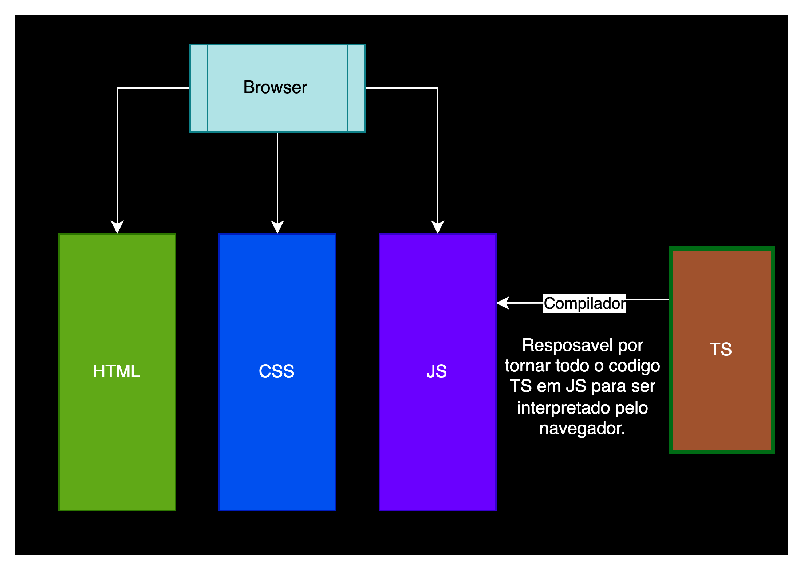

# Typescript

Podemos considerar o TS como o filho prodigio do JS, tudo que você consegue fazer com JS irá conseguir fazer no TS. A diferença entre eles é que com o JavaScript não existem regras relacionadas a tipo e no o TypeScript ele cria suas próprias regras para evitar que erros lá na frente venham a aparecer.

Em projetos pequenos normalmente você não vai ter problemas, mas em projetos grandes onde diferentes programadores irão atuar no mesmo código.

Podemos definir o Typescript como um Javasript com tipos.

## Como funciona o TS

O HTML, o CSS e o JavaScript são linguagens interpretadas pelo browser. O TS não é uma linguagem interpretada pelo browser, e agora? como tudo isso irá funcionar?



## Preparação de ambiente

```
  npm i -g typescript
```

verifique se foi instalado corretamente digitando

> tsc -v

### Indicação de extensões:

1. Material Icon Theme
2. Lint
3. Path intellisense
4. Prettier

## Configurando o TS

Para criar o arquivo de configuração `tsconfig.json` você precisa rodar `tsc --init`. Um arquivo deve ser criado na raiz do seu projeto. As opções de configuração podem ser encontradas na [documentação](https://www.typescriptlang.org/pt/docs/handbook/tsconfig-json.html).

## Tipos

O Typescript aceita todos os tipos do Javascript: number, string, boolean, undefined, object, null. No entando o ts tem seus proprios tipos além desse, são eles: any, unknow, tuple, never e enum.

### any

O any significa qualquer tipo. Embora o any possa ser útil em certas situações, seu uso excessivo pode diminuir a segurança e a confiabilidade do código TypeScript.

### unknown

O tipo unknown foi introduzido para fornecer uma abordagem mais segura para lidar com valores desconhecidos. Embora seja parecido com o any, eles têm propósitos e comportamentos distintos. Quando uma variável é declarada como unknown, é necessário realizar uma verificação de tipo ou uma atribuição de tipo antes de utilizá-la. Isso incentiva a escrita de código mais seguro e explícito.

### array

Os arrays devem receber os tipos que poderá armazenar.

### tuple

Normalmente um array contém de zero à muitos objetos de um mesmo tipo. O TypeScript possui uma análise especial sobre arrays que contêm múltiplos tipos, e quando a ordem em que eles estão indexados é importante. Esses são chamados de tuplas. Pense nelas como uma forma para conectar dados, mas com menos sintaxe que os objetos. Você pode criar uma tupla usando a sintaxe de um array do JavaScript.

### enum

O Enum nos permite declarar um conjunto de valores/constantes pré-definidos.

### objetos

Os objetos nos permitem passar a tipagem de acordo com todas as chaves existentes no objeto, inclusive se ela é mandatórioa ou não.

### never

Diferente do any que tende a retornar null ou undefined, o never não retorna absolutamente nada. Esse tipo também é conhecido como tipo inabitável ou inferior. Assim como temos zero em nosso sistema numérico para denotar a quantidade de nada, precisamos de um tipo para denotar impossibilidade em nosso sistema de tipos.

---

Feito com muito carinho por [Lis](https://github.com/lisandrascruz) <3
