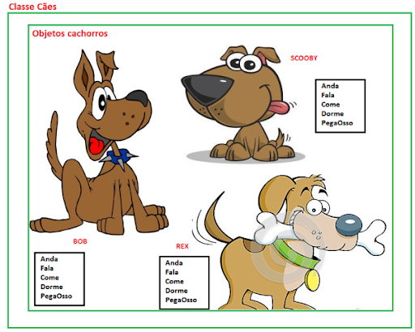

# Programação Orientada a Objetos

A Programação Orientada a Objetos (POO) é um paradigma fundamental no desenvolvimento de software. Ela aborda não apenas a maneira como escrevemos código, mas também como organizamos e estruturamos nossas aplicações. Em JavaScript e TypeScript, a POO nos permite criar códigos mais limpos, reutilizáveis e fáceis de manter.

## Atribuotos

Atributos de uma classe também conhecido como propriedades, descrevem um intervalo de valores que as instâncias da classe podem apresentar.

Um atributo é uma variável que pertence a um objeto. Os dados de um objeto são armazenados nos seus atributos.

Informações sobre o objeto. Dados que posso armazenar.

## Métodos

Os métodos são procedimentos ou funções que realizam as ações próprias do objeto. Assim, os métodos são as ações que o objeto pode realizar. Tudo o que o objeto faz é através de seus métodos, pois é através dos seus métodos que um objeto se manifesta, através deles que o objeto interage com os outros objetos.

Sendo mais conhecidos como: Método Construtor, Métodos Get e Set, Métodos do usuário e Método sobrescrito

## Classe

Classe é um conjunto de características e comportamentos que definem o conjunto de objetos pertencentes à essa classe. Repare que a classe em si é um conceito abstrato, como um molde, que se torna concreto e palpável através da criação de um objeto. Chamamos essa criação de instanciação da classe, como se estivéssemos usando esse molde (classe) para criar um objeto.

## Objetos

Objetos são instâncias de classes, que determinam qual informação um objeto contém e como ele pode manipulá-la. É uma entidade capaz de reter um estado (informação) e que oferece uma série de informações (comportamento) ou para examinar ou para afetar este estado. É através deles que praticamente todo o processamento ocorre em sistemas implementados com linguagens de programação orientada a objetos.

---

Fonte:

- https://www.alura.com.br/artigos/poo-programacao-orientada-a-objetos
- https://medium.com/@TDamiao/16-conceitos-poo-programa%C3%A7%C3%A3o-orientada-a-objeto-6cdc72ac3ee2
